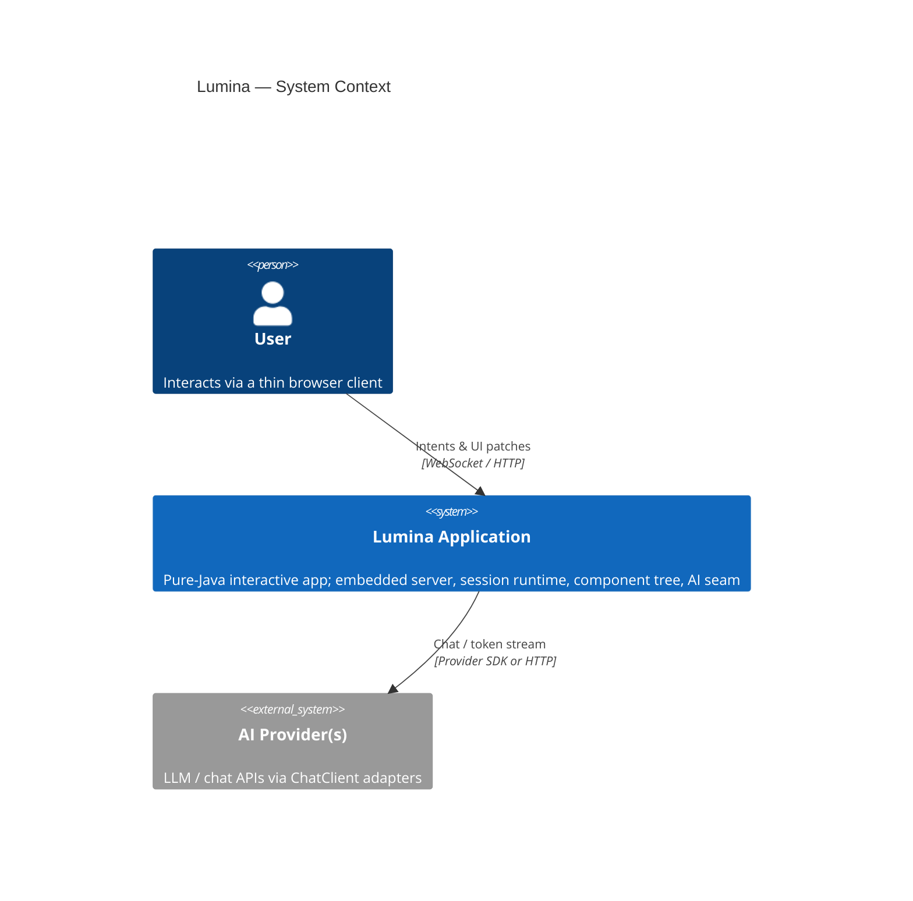
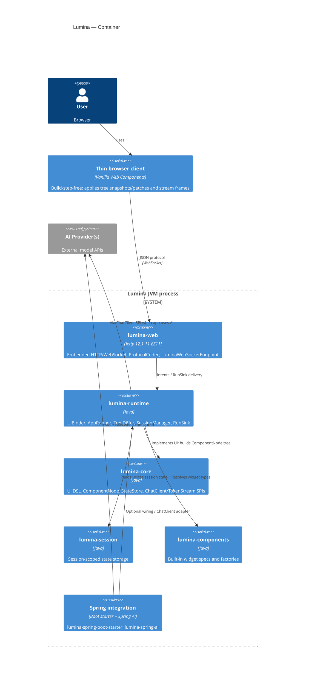
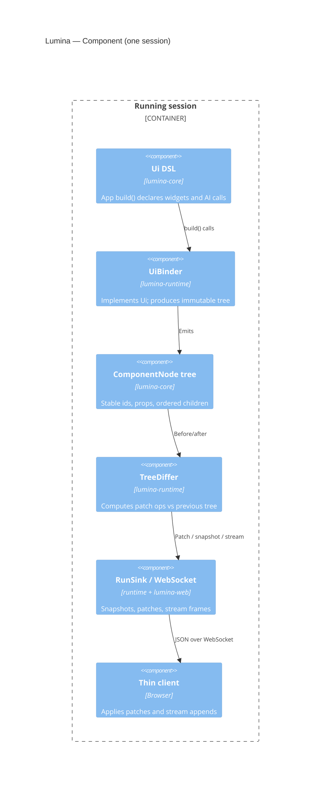

# Lumina Architecture

Authoritative technical architecture for Lumina (`0.3.0-SNAPSHOT`). Companion to [`VISION.md`](VISION.md). Accepted decisions live in [`docs/adr/`](adr/), including the Phase 0 direction-setting ADRs (007–012).

---

## 1. C4 diagrams

### System Context

User and browser interact with a Lumina application process. That process calls external AI providers through framework-neutral SPIs (adapters optional).

### Container

A single JVM hosts the embedded Jetty server, runtime, and domain modules. Spring integration is optional.

### Component (running session)

Inside one interactive session: app code drives the `Ui` DSL; the runtime binds a tree, diffs it, and pushes results over the transport to the thin client.

---

## 2. Module boundaries

Lumina is a ten-module Maven reactor. Dependency direction follows Clean Architecture: **API → Service/Runtime → Domain ← Infrastructure**. `lumina-core` depends on **nothing** Lumina-internal. Spring, Jetty, and Servlet APIs stay at the edges. See [ADR-001](adr/ADR-001-module-boundaries.md).

| Module | Role |
|--------|------|
| `lumina-core` | Public API and domain types: `Ui`, `ComponentNode`, `StateStore`, `ChatClient` / `TokenStream`, SPI packages. No Spring/Jetty. |
| `lumina-session` | Session-scoped state implementation backing `StateStore`. |
| `lumina-components` | Built-in component specs/factories (text, markdown, chat, tables, …). |
| `lumina-runtime` | `UiBinder`, `AppRunner`, `TreeDiffer`, `SessionManager`, `RunSink`; serial-per-session execution. No Spring/Jetty. |
| `lumina-web` | Embedded Jetty (`LuminaServer`, `LuminaWebSocketEndpoint`), wire codec, static thin client. |
| `lumina-devtools` | Dev-time helpers (e.g. reload stubs). |
| `lumina-spring-boot-starter` | Optional Boot auto-configuration and properties. |
| `lumina-spring-ai` | Optional Spring AI adapter for the `ChatClient` SPI. |
| `lumina-cli` | Project scaffolding / run tooling. |
| `lumina-examples` | Sample apps (Hello World, streaming demos). |

**Dependency rule (hard):**

- Domain/public API (`lumina-core`) ← consumed by runtime, session, components, web, Spring modules.
- Runtime may depend on core, session, and components — never on `lumina-web` or Spring.
- Infrastructure (`lumina-web`, Spring modules) adapts inward; they must not leak Jetty/Spring types into core or runtime public APIs.
- Public API packages remain `io.lumina`, `io.lumina.ui`, `io.lumina.state`, `io.lumina.ai`, `io.lumina.spi` ([ADR-001](adr/ADR-001-module-boundaries.md)).

Scale model: **single-node default** (in-memory sessions). State store and transport are SPIs so Phase 7 clustering can slot in without core rewrites.

---

## 3. Component model

Today the server builds an immutable [`ComponentNode`](../lumina-core/src/main/java/io/lumina/model/ComponentNode.java) tree (`id`, `type`, `props`, `children`). Children are effectively a **flat** list under the root — sufficient for current widgets, insufficient for nested layout containers.

**Direction (ADR-007):** evolve to a true **nested** `ComponentNode` tree with stable keys so layout containers (columns, tabs, sidebars, …) can hold children. Keying continues to follow [ADR-004](adr/ADR-004-state-keying.md) (`path/type#index`, optional `withKey` path segments).

Forward reference: [ADR-007 — Nested component tree & layout containers](adr/ADR-007-nested-component-tree.md).

---

## 4. Rendering engine

Rendering is **server-driven**:

1. On connect or recovery, the runtime builds a full `ComponentNode` tree and sends a **snapshot**.
2. On each interaction (and for streaming flushes), `TreeDiffer` compares previous vs new tree and emits ordered **patch** operations ([ADR-003](adr/ADR-003-wire-protocol-diff.md)).
3. During `ui.ai(TokenStream)`, the runtime may flush an interim structural patch, then emit text-only **stream** frames (`start` / `append` / `end`) via `RunSink` ([ADR-006](adr/ADR-006-streaming-protocol.md)).
4. The thin client applies snapshots/patches and appends streamed text by node id — no user-authored HTML/CSS/JS; no client-side app framework.

The client contract stays minimal: interpret protocol messages, maintain a DOM mirror of the tree, and forward intents. Layout/theming may grow the client later without breaking the server-owned tree model.

---

## 5. State management

Session state is server-scoped and confined to the session execution queue ([ADR-002](adr/ADR-002-rerun-concurrency.md), [ADR-004](adr/ADR-004-state-keying.md)):

- App-owned values via `StateStore` (session map today; **typed**, session-scoped state is the formalization target).
- Widget values persist across reruns; one-shot intents (clicks, chat submit) are consumed once.
- Lifecycle: create on WebSocket open / session start; destroy on close; **TTL / eviction hooks** for idle sessions and memory bounds.

Forward references: [ADR-008 — State model & server-side routing](adr/ADR-008-state-and-routing.md), [ADR-010 — Security & session lifecycle](adr/ADR-010-security-and-session-lifecycle.md).

---

## 6. Routing

Routing is **not shipped yet** (status matrix: P1 gap). Target model:

- Server-side `path → view` mapping (multi-page apps without a client router).
- URL path and query as **addressable state** — navigable, bookmarkable, and restorable on reconnect alongside session state.

Forward reference: [ADR-008 — State model & server-side routing](adr/ADR-008-state-and-routing.md).

---

## 7. Transport protocol

**Today:** JSON over WebSocket (`LuminaWebSocketEndpoint` in `lumina-web`). Message shapes and diff ops are defined in [ADR-003](adr/ADR-003-wire-protocol-diff.md). Streaming frames and `RunSink` delivery are defined in [ADR-006](adr/ADR-006-streaming-protocol.md). Embedded server bootstrap is [ADR-005](adr/ADR-005-embedded-server.md).

**Evolution:** keep WebSocket as the primary transport; add **SSE fallback** and reconnect/resume semantics behind a transport SPI so Phase 7 clustering and alternate clients can plug in without rewriting the runtime.

Forward reference: [ADR-012 — Transport evolution](adr/ADR-012-transport-evolution.md).

---

## 8. AI seam

Framework-neutral AI types live in `lumina-core`:

- `ChatClient` — prompt → completion / stream entry point for apps.
- `TokenStream` — iterable token chunks consumed by `ui.ai(...)`.

Providers ship as **thin adapters** (e.g. `lumina-spring-ai` bridging Spring AI). Optional capability SPIs (tools, embeddings/RAG, usage/cost) extend the seam without forcing every provider to implement everything.

Forward reference: [ADR-011 — AI capability SPIs](adr/ADR-011-ai-capability-spis.md).

---

## 9. Extensibility SPIs

Design clean SPI seams now; defer public plugin SDK/packaging to Phase 8:

| SPI | Purpose |
|-----|---------|
| Component registry | Register custom component types/factories |
| AI provider | Adapt external models to `ChatClient` / capability SPIs |
| Transport | WebSocket today; SSE / alternate channels later |
| Rendering | Server tree → client presentation hooks |
| Theme | Theming / dark mode hook points (Phase 6+) |

Forward reference: [ADR-009 — Extensibility SPIs](adr/ADR-009-extensibility-spis.md).

---

## 10. Security model

Baseline and planned controls:

| Concern | Status / direction |
|---------|-------------------|
| Cross-Site WebSocket Hijacking / origin checks | Exists in `lumina-web` (CSWSH/origin) |
| Auth / SSO + RBAC | Hook points for Phase 7; not implemented in kernel |
| Session-id entropy | Cryptographically strong session identifiers |
| Upload limits | Bound file upload size and count per session |
| Session TTL / eviction | Idle timeout and hard caps to prevent unbounded growth |

Forward reference: [ADR-010 — Security & session lifecycle](adr/ADR-010-security-and-session-lifecycle.md).

---

## 11. Concurrency model

Each session owns **one serial execution queue**. Initial builds and interaction-triggered reruns run in submission order on **virtual threads**. No two application builds for the same session run concurrently. Sessions are independent and may execute in parallel with one another.

See [ADR-002](adr/ADR-002-rerun-concurrency.md). State and binder classes rely on that confinement rather than internal locking ([ADR-004](adr/ADR-004-state-keying.md)).

---

## 12. Performance goals

Draft targets — testable in Phase 10, adjustable:

| Metric | Target |
|--------|--------|
| p95 interaction round-trip (intent → patch applied), in-region, trivial rerun | < 100 ms |
| Concurrent active sessions per node (baseline, 2 vCPU / 2 GB) | ≥ 1,000 |
| Typical patch payload (single-widget change) | < 8 KB |
| Reconnect to interactive (fresh snapshot) | < 2 s |
| Streaming append frame overhead (per chunk, server-side) | < 1 ms |
| Cold start (embedded server ready) | < 3 s |

---

## 13. Non-functional requirements

- Backward-compatible wire protocol within a MINOR.
- Binary-compatible public API within a MINOR (pre-1.0 caveat documented).
- No unbounded per-session memory growth.
- All public API Javadoc'd.
- Zero user-authored HTML/CSS/JS.
- Graceful degradation when a transport/provider capability is absent.

---

## 14. Tech stack

Verified platform versions (Group A upgrade, parent `pom.xml`):

| Component | Version | Notes |
|-----------|---------|-------|
| Java | **25** | `java.version` / `maven.compiler.release` |
| Spring Boot | **4.1.0** | `spring-boot-dependencies` BOM |
| Spring AI | **2.0.0** | `spring-ai-bom` |
| Jetty | **12.1.11** (EE11) | `jetty-bom` + `jetty-ee11-bom`; Servlet 6.1 |
| Jackson | **2.x** isolated in `lumina-web` | `ProtocolCodec` pins Jackson 2 (`com.fasterxml.jackson.*`) via `jackson-bom`; Spring modules inherit Boot 4's Jackson 3 |

Jackson 2 stays confined to `lumina-web` (not a Spring module). No forced migration unless a conflict surfaces.
