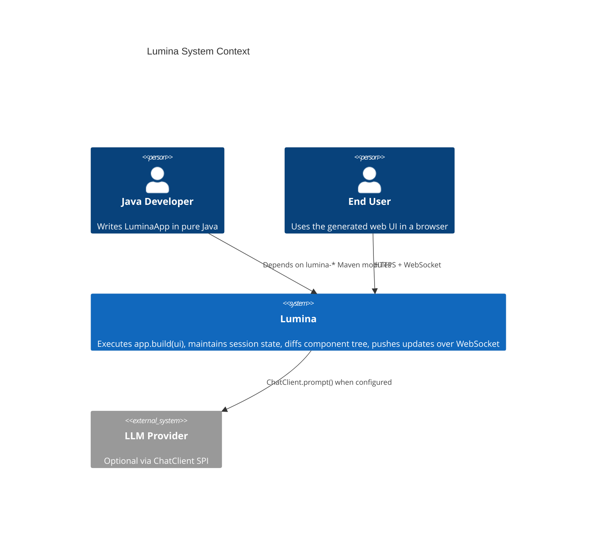
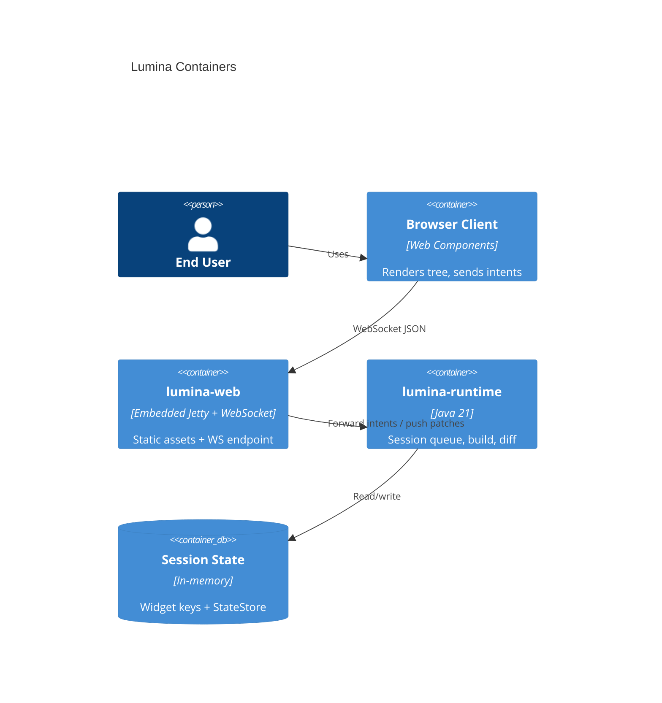
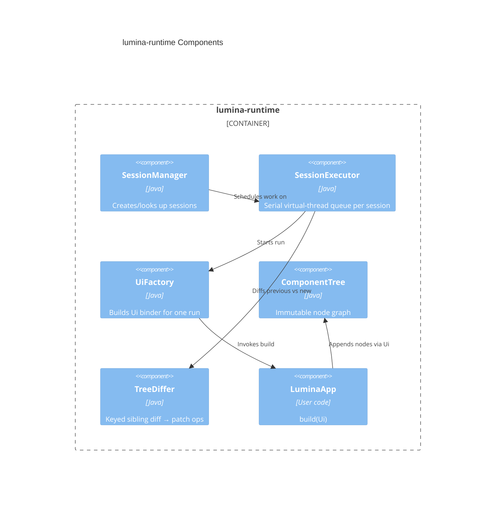

# Lumina Phase 1 — Architecture Design

**Status:** Approved (design dialogue 2026-07-18)  
**Product:** Lumina  
**Version target:** `0.1.0-SNAPSHOT`  
**Java:** 21+

## 1. Mission

Lumina is an open-source Java framework inspired by Streamlit, designed for modern Java and AI applications.

It is **not** a general web framework, MVC stack, Vaadin clone, or React wrapper.

Developers build interactive web applications in pure Java — zero HTML, CSS, or JavaScript in application code. The framework owns rendering, session state, and real-time UI updates.

### Canonical example (Hello AI, &lt;20 lines of user code)

```java
public final class HelloAiApp implements LuminaApp {
    private final ChatClient chat = ChatClients.echo();

    @Override
    public void build(Ui ui) {
        ui.title("Hello AI");
        List<String[]> history = ui.state().computeIfAbsent("history", k -> new ArrayList<>());
        for (String[] turn : history) {
            ui.user(turn[0]);
            ui.ai(turn[1]);
        }
        String prompt = ui.chatInput();
        if (prompt != null) {
            String reply = chat.prompt(prompt);
            history.add(new String[] { prompt, reply });
            ui.user(prompt);
            ui.ai(reply);
        }
    }
}
```

## 2. Decisions locked in design dialogue

| Topic | Choice |
|-------|--------|
| Identity | Product **Lumina**; Maven `io.lumina:lumina-*`; packages `io.lumina.*` |
| App model | `LuminaApp` + `void build(Ui ui)` |
| Transport | WebSocket primary; transport SPI for future SSE |
| State | Hybrid: auto-keyed widgets + explicit `StateStore` |
| Spring | Core/runtime Spring-free; Spring Boot optional via starter |
| Browser | Thin custom client + Web Components + JSON tree diffs |
| AI | `ChatClient` SPI + in-framework echo stub |
| Module shape | Strict multi-module Clean Architecture |

## 3. Goals & non-goals

### Goals (Phase 1)

- Java-first declarative DSL (`Ui`)
- Server-side component tree with incremental diffing
- WebSocket real-time updates
- Session-scoped state; serial execution per session on virtual threads
- Auto-configuration via Spring Boot starter (optional path)
- Modular Maven architecture; SPI extensibility
- MVP component set (see §7)
- Working Hello AI example
- Unit and integration tests from the start
- Javadoc on every public API
- ADRs for major subsystems; C4 diagrams in this spec

### Non-goals (deferred)

- Token streaming for `ui.ai(...)`
- SSE transport implementation
- Spring AI adapter
- Clustered / Redis-backed sessions
- Full hot-reload DX polish
- Rich theming / CSS escape hatches for apps
- React/Lit/Vaadin compatibility layers

## 4. C4 architecture

### 4.1 Context



### 4.2 Containers



### 4.3 Components (runtime)



## 5. Maven module boundaries

| Module | Responsibility | May depend on |
|--------|----------------|---------------|
| `lumina-parent` | BOM, plugin versions, Java 21 | — |
| `lumina-core` | `LuminaApp`, `Ui`, component model, SPI interfaces | — (no Spring/Servlet/WS) |
| `lumina-session` | Session-scoped state, keyed widget state, `StateStore` | `lumina-core` |
| `lumina-components` | Built-in component definitions / factories | `lumina-core` |
| `lumina-runtime` | Rerun loop, tree build, diff, session executor | `core`, `session`, `components` |
| `lumina-web` | Embedded HTTP + WebSocket, static client, JSON protocol | `core`, `runtime` |
| `lumina-devtools` | Hot-reload hooks (Phase 1: skeleton) | `runtime` |
| `lumina-spring-boot-starter` | Auto-config when `LuminaApp` bean present | `web`, `runtime` |
| `lumina-cli` | `lumina run` skeleton | `web` / starter |
| `lumina-examples` | Hello AI and future samples | starter |

### Dependency rule (hard)

```
examples → starter → (runtime, components, session, web)
devtools → runtime
cli → web / starter
runtime → core + session + components
web → core + runtime
session → core
components → core
core → (nothing Lumina-internal)
```

`lumina-core` must not import Spring, Jakarta Servlet, or WebSocket APIs.

## 6. Public API & execution model

### 6.1 App contract

```java
package io.lumina;

@FunctionalInterface
public interface LuminaApp {
    void build(Ui ui);
}
```

### 6.2 Ui DSL (Phase 1)

```java
package io.lumina.ui;

public interface Ui {
    void title(String text);
    void markdown(String md);
    void text(String text);
    boolean button(String label);
    String textInput(String label);
    String chatInput();                 // null if no new submit this run
    void user(String message);
    void ai(String message);
    void code(String language, String source);
    void json(Object value);
    void table(List<Map<String, Object>> rows);
    void image(String urlOrResource);
    Optional<UploadedFile> fileUpload(String label);
    void progress(double value);        // 0.0–1.0 inclusive
    StateStore state();
    <T> T withKey(String key, Function<Ui, T> block);
}
```

Phase 1 `table` accepts `List<Map<String, Object>>` only. A typed `TableModel` may be added later as an overload without breaking this method.

### 6.3 Rerun lifecycle

1. Browser connects → session created → initial `build(ui)` on a virtual thread.
2. User intent arrives over WebSocket (click, input, chat submit, file upload).
3. Runtime applies intent to session state.
4. Runtime re-runs `build(ui)` and produces a new component tree.
5. Diff engine compares previous vs new tree → patch ops.
6. Server pushes `{type:"patch"}` (or full `{type:"snapshot"}` on connect/reconnect).
7. Client applies patches to Web Components.

### 6.4 Concurrency

- **One serial work queue per session** — no concurrent `build` for the same session.
- Virtual threads execute session work and blocking `ChatClient` calls.
- Sessions are isolated; no shared mutable app state unless the user introduces it.

### 6.5 Widget keys & StateStore

- Widgets auto-key by type + call order within a stable path.
- Explicit keys via `ui.withKey("k", u -> ...)`.
- Chat history and other app-owned data live in `StateStore`, not only in ephemeral widget returns.

`StateStore` Phase 1 API (interface in `io.lumina.state`):

```java
public interface StateStore {
    <T> T get(String key);
    void set(String key, Object value);
    <T> T computeIfAbsent(String key, Function<String, T> mappingFunction);
    boolean contains(String key);
    void remove(String key);
}
```

## 7. MVP components

| DSL | Purpose |
|-----|---------|
| `title` | Page / section title |
| `markdown` | Markdown rendering |
| `text` | Plain text |
| `button` | Click → boolean this run |
| `textInput` | Labeled text field |
| `chatInput` | Chat composer; returns submitted prompt or null |
| `user` / `ai` | Chat message bubbles |
| `code` | Fenced code block |
| `json` | JSON viewer |
| `table` | Tabular data |
| `image` | Image by URL/resource |
| `fileUpload` | File upload → `Optional<UploadedFile>` |
| `progress` | Progress indicator 0.0–1.0 |

## 8. Component tree, diffing & wire protocol

### 8.1 Server model

- Immutable `ComponentNode`: `id`, `type`, `props`, `children`.
- `Ui` appends nodes during `build()`.
- Runtime retains `TreeSnapshot` per session.

### 8.2 Diff ops

- Identity by stable widget key / node id.
- Ops: `ADD`, `REMOVE`, `REPLACE`, `UPDATE_PROPS`, `REORDER`.
- Phase 1 algorithm: keyed list diff at sibling level (upgradeable without public API break).
- Optimize for chat append (common case: one new message node).

### 8.3 Wire protocol (JSON over WebSocket)

**Client → Server**

```json
{ "type": "intent", "sessionId": "...", "name": "submit_chat", "payload": { } }
{ "type": "intent", "name": "click", "targetId": "..." }
{ "type": "intent", "name": "input", "targetId": "...", "value": "..." }
```

**Server → Client**

```json
{ "type": "snapshot", "root": { } }
{ "type": "patch", "ops": [ { "op": "ADD" } ] }
{ "type": "error", "message": "..." }
```

### 8.4 Browser client

- Framework-owned minimal JS + Web Components (`<lumina-app>`, `<lumina-title>`, …).
- Type → component registry; patch applier; intent emitter.
- No business logic in the browser; no React/Lit dependency.

## 9. Packages & SPI

### 9.1 Public packages (apps may import)

| Package | Module | Contents |
|---------|--------|----------|
| `io.lumina` | core | `LuminaApp`, bootstrap helpers |
| `io.lumina.ui` | core | `Ui`, upload types |
| `io.lumina.state` | core (interface) + session (impl) | `StateStore` API in core; default impl in `lumina-session` |
| `io.lumina.ai` | core | `ChatClient`, `ChatClients` |
| `io.lumina.spi` | core | Extension points |

### 9.2 Internal packages (unstable)

`io.lumina.runtime.*`, `io.lumina.session.internal.*`, `io.lumina.web.internal.*`, `io.lumina.diff.*`

### 9.3 SPI (Phase 1)

- `ChatClient` — `String prompt(String input)` (streaming interface later).
- Echo implementation via `ChatClients.echo()`.
- Transport SPI stub; WebSocket is the only Phase 1 implementation.
- Custom component SPI reserved; not required for MVP widgets.

## 10. Error handling

- `LuminaException` hierarchy for framework errors.
- User-code failures during `build`: keep last good tree; send non-sensitive `{type:"error"}` to client; log server-side.
- Never send stack traces, tokens, or PII to the browser.
- Core uses `System.Logger`; Spring starter may bridge to SLF4J.

## 11. Spring Boot starter

- Auto-configures embedded Lumina server when a `LuminaApp` bean is present.
- Does **not** introduce Spring types into `lumina-core` or `lumina-runtime`.
- Alternate path: `Lumina.bootstrap(app)` for plain Java.

## 12. Devtools & CLI (Phase 1 stubs)

- `lumina-devtools`: reload SPI + classpath watcher placeholder.
- `lumina-cli`: `lumina run` boots embedded server for an example/app class.
- Full hot-reload DX is out of Phase 1 scope.

## 13. Versioning & compatibility

- Start at `0.1.0-SNAPSHOT`.
- Semantic versioning.
- Public API = packages in §9.1 only.
- Design for binary compatibility; introduce japicmp (or equivalent) from the first stable `0.1.0` release.

## 14. Embedded server

**Decision (ADR-005):** JDK `com.sun.net.httpserver.HttpServer` has no WebSocket support, so it is **not** viable as the Phase 1 server.

Phase 1 uses **embedded Jetty** (HTTP + WebSocket) inside `lumina-web` only. Core and runtime remain free of Jetty/Servlet types. Hide Jetty behind an internal `LuminaHttpServer` abstraction so the engine can be swapped later without changing app APIs.

## 15. Testing strategy

| Layer | Test type |
|-------|-----------|
| Diff engine, keys, `StateStore` | JUnit 5 unit tests |
| `Ui` → component tree | Unit tests (no browser) |
| Rerun + intent apply | Runtime integration tests |
| WebSocket protocol | Integration test with JDK WS client |
| Hello AI | Smoke: connect → submit → patch contains AI reply |

Coverage target: follow project JaCoCo gate when configured (minimum 70% where enabled).

## 16. Architecture Decision Records

ADRs live under `docs/adr/` and are written before implementing each subsystem:

| ID | Title |
|----|-------|
| ADR-001 | Module & package boundaries |
| ADR-002 | Rerun & session concurrency model |
| ADR-003 | Wire protocol & diff ops |
| ADR-004 | State keying strategy |
| ADR-005 | Embedded server choice |

## 17. Phase 1 deliverables checklist

- [ ] Multi-module Maven reactor (`lumina-*`)
- [ ] Core API + runtime rerun loop
- [ ] Session state (hybrid)
- [ ] WebSocket + JSON protocol + WC client
- [ ] All MVP components (§7)
- [ ] `ChatClient` SPI + echo
- [ ] Spring Boot starter auto-config
- [ ] CLI + devtools skeletons
- [ ] Hello AI example (&lt;20 lines user code)
- [ ] Unit + integration tests
- [ ] Javadoc on public APIs
- [ ] ADR-001…005
- [ ] C4 diagrams (this document)

## 18. Implementation approach

Work iteratively. For each subsystem:

1. Write/confirm ADR.
2. Implement behind module boundaries.
3. Add tests with the code.
4. Keep commits small and cohesive.
5. Do not break public API without SemVer-major justification (pre-1.0: document breaks in changelog).

**Next step after this spec is approved:** write a detailed implementation plan (`docs/superpowers/plans/…`) via the writing-plans skill, then execute Phase 1.
